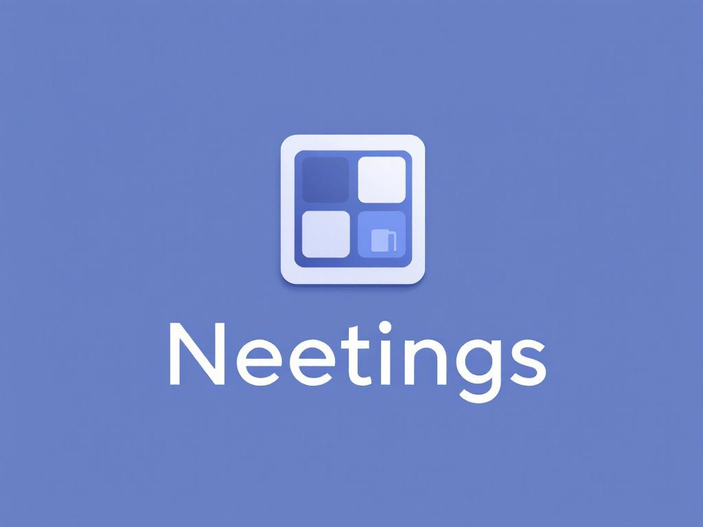
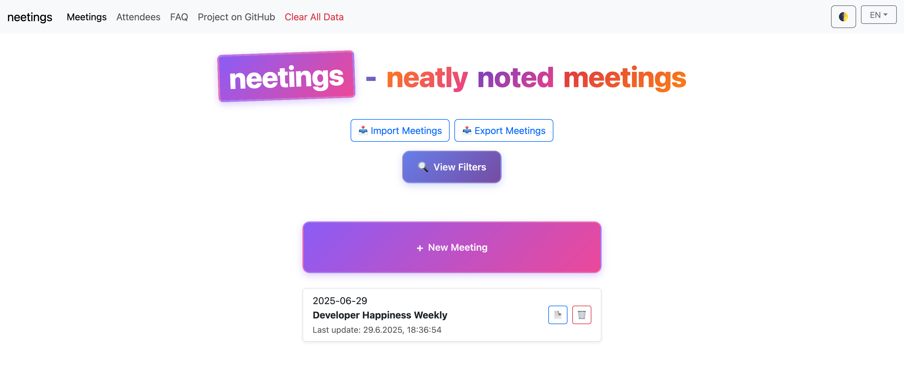
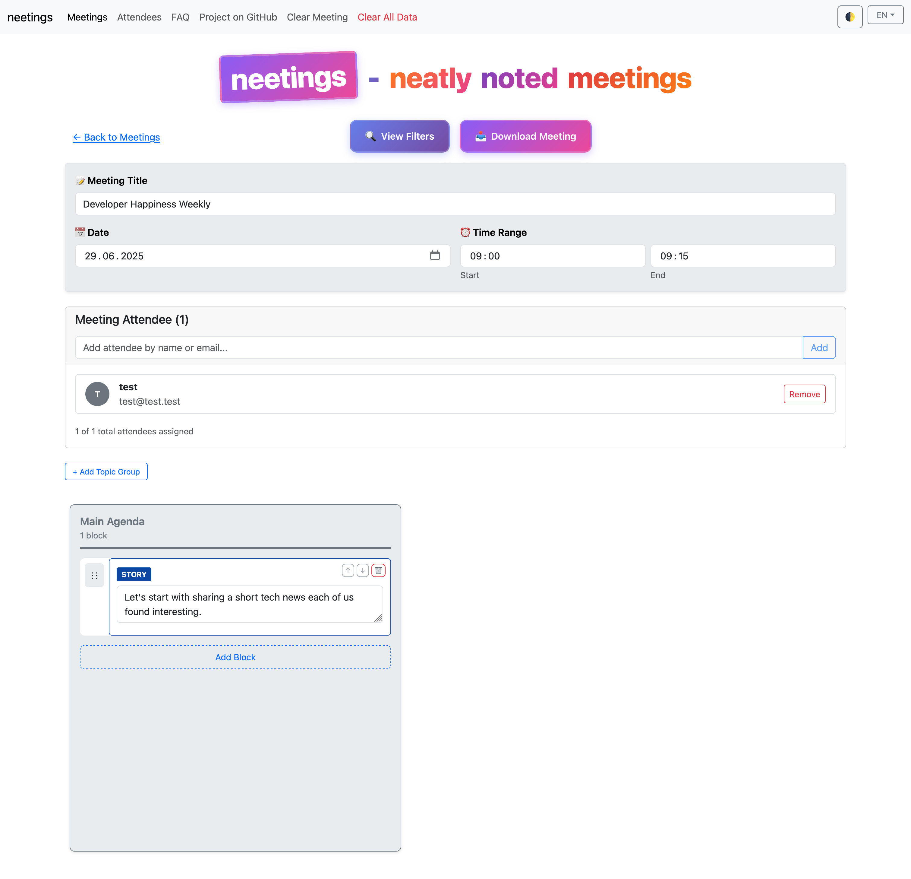
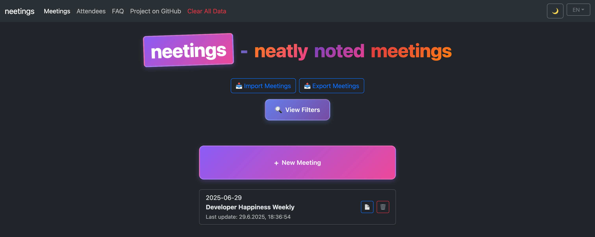
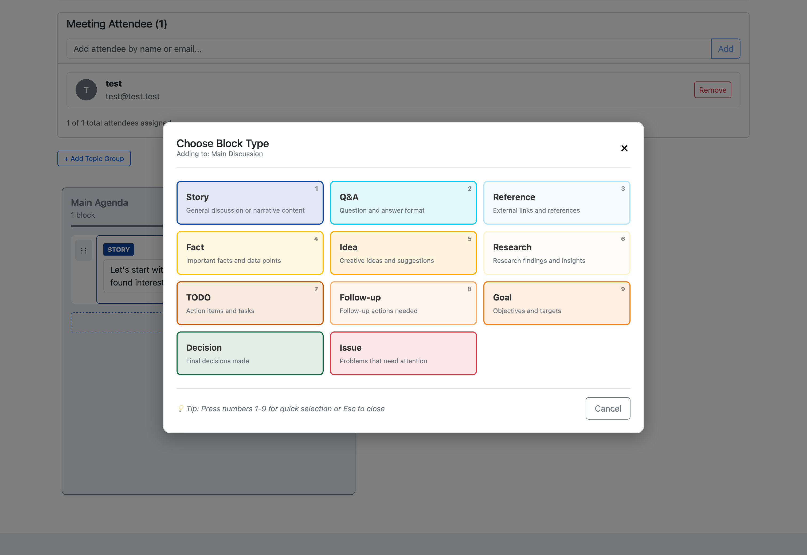
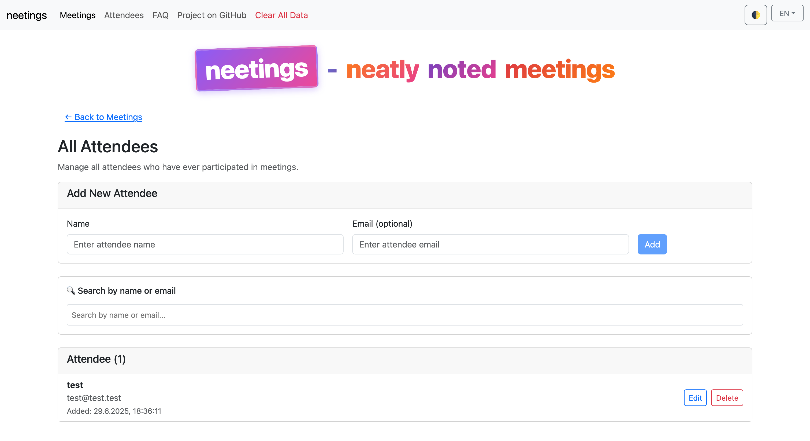
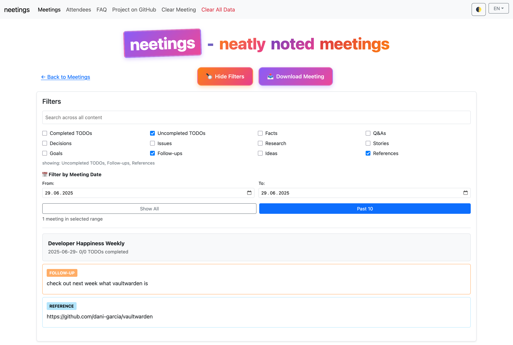
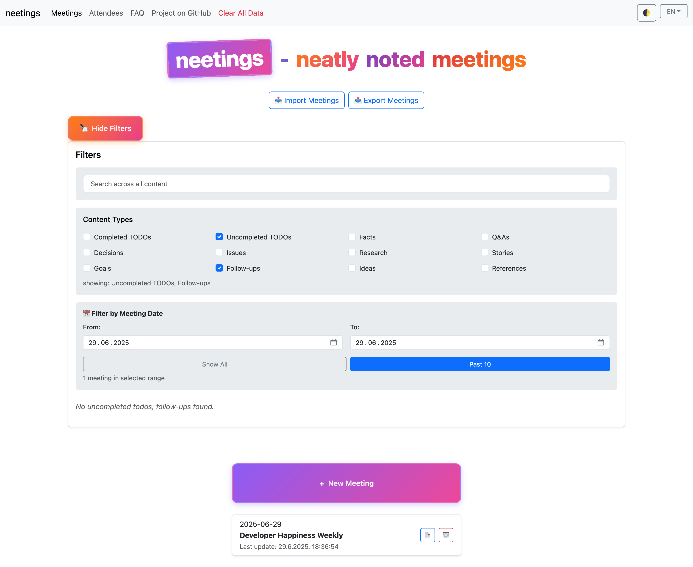
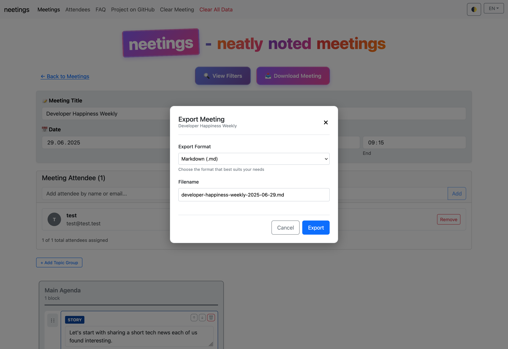

# 📝 Neetings

neatly noted meetings 🤓



### The Modern Meeting Management Platform That Actually Works

> Transform chaotic meetings notes into organized, actionable outcomes with zero
> backend complexity

[](https://www.neetings.com)

---

> [!CAUTION]
> 99 % of this project is vibe coded!

---

## Data Sensitivity Notice

**Neetings is designed for local data storage.** All meeting content is stored
in your browser's localStorage, ensuring privacy and control. No backend servers
are used, so your data remains on your device.

## 🌟 Why Choose Neetings?

**Stop losing track of meeting decisions.** Stop hunting through scattered
notes. Stop wondering "what did we actually decide?"

Neetings transforms your meetings from talk-fests into action-machines with
**intelligent block-based organization**, **visual Kanban management**, and
**smart attendee tracking** - all running 100% in your browser.

### 🎯 **Perfect For**

- **Team Leads** managing multiple project discussions
- **Product Managers** tracking decisions across features
- **Consultants** organizing client meetings and follow-ups
- **Agile Teams** running sprint planning and retrospectives
- **Anyone** tired of messy, unstructured meeting notes

---

## ✨ What Makes Neetings Different

### 🧱 **11 Smart Block Types**

Stop fighting with generic text boxes. Each content type gets its own
intelligent block:

| 📝 **Notes**         | 💡 **Ideas**           | ✅ **Decisions**  | ⚠️ **Issues**       |
| -------------------- | ---------------------- | ----------------- | ------------------- |
| Context & background | Brainstorming concepts | Final resolutions | Problems & blockers |

| ☑️ **TODOs** | 🎯 **Goals**         | 📋 **Follow-ups**    | 🔬 **Research**        |
| ------------ | -------------------- | -------------------- | ---------------------- |
| Action items | Strategic objectives | Next meeting actions | Investigation findings |

| 💡 **Facts**    | ❓ **Q&A**                | 📚 **References**  |
| --------------- | ------------------------- | ------------------ |
| Key data points | Discussion clarifications | External resources |

### 🗂️ **Kanban View That Makes Sense**

Switch from linear notes to **visual topic columns** instantly. Drag and drop
blocks between topics, reorder priorities, and see your meeting structure at a
glance.

### 👥 **Attendee Management Done Right**

- **Global attendee registry** with smart autocomplete
- **Flexible email handling** - email addresses are optional for maximum
  flexibility
- **Visual participation tracking** across all meetings
- **One-click assignment** with duplicate prevention
- **Meeting attendance statistics** to track engagement
- **Safe search functionality** that handles attendees with or without email
  addresses

### 🔍 **Find Anything, Instantly**

- **Real-time search** across all meetings and content
- **Advanced filtering** by block type, completion status, and date ranges
- **Smart suggestions** as you type with 500ms debounce
- **Combined filters** for laser-focused results

---

## See It In Action

### 📝 Meeting Overview

 _Main
dashboard showing meetings list with quick access to all your organized
meetings_

### 🏠 Meeting Management View


_Block-based meeting organization with smart content types and visual hierarchy_

### 🎨 Dark Mode Support

 _Elegant dark
theme with system preference detection for comfortable viewing_

### 🧱 Smart Block Type Selection


_11 intelligent block types with keyboard shortcuts for rapid content creation_

### 👥 Attendee Management


_Smart attendee tracking with autocomplete and flexible email handling_

### 🔍 Advanced Filtering


_Powerful search and filter capabilities to find content instantly_

### 📊 Overview with Filters


_Dashboard view with advanced filtering options for meeting management_

### 📤 Export Options


_Multiple export formats (Markdown, RTF, DOCX, HTML) for seamless data
portability_

---

## 🚀 Get Started in 30 Seconds

### Option 1: Try the Live Demo

**[👆 Click here to try Neetings instantly →](https://www.neetings.com)**

No installation, no signup, no backend. Start organizing your first meeting in
seconds.

### Option 2: Run Locally

```bash
# Clone and run (requires Node.js 18+)
git clone https://github.com/simonneutert/neetings.git
cd neeting-jsx && npm install && npm run dev
```

Open [localhost:5173](http://localhost:5173) - that's it!

### Option 3: Docker

```bash
docker-compose up dev
```

---

## 🎯 Core Features That Save You Time

### ⚡ **Two-Step Block Creation**

1. Click **"+ Add New Block"** anywhere
2. Select from **11 specialized block types** in a responsive modal
3. Start typing immediately with smart auto-focus

**Keyboard shortcuts:** Press 1-9 for instant block type selection.

### 🎨 **Visual Organization**

- **📄 List View:** Traditional linear layout for note-taking
- **📋 Kanban View:** Column-based visual organization for complex topics
- **🎯 Topic Groups:** Create custom categories and drag blocks between them
- **🌈 Color-coded types:** Instant visual identification of content types
- **🌓 Dark Mode:** Switchable light/dark themes with system preference
  detection

### ✅ **TODO Management That Works**

- **Interactive checkboxes** with instant completion toggle
- **Separate filters** for completed vs. pending items
- **Visual progress indicators** with strikethrough styling
- **Meeting-wide completion stats** in the filter dashboard

### 👥 **Smart Attendee System**

- **Autocomplete by name or email** with instant results
- **Flexible attendee creation** - save attendees with just a name or include
  email
- **Participation tracking** showing meeting counts per attendee
- **Avatar generation** with colored initials for visual identification
- **Cross-meeting analytics** to see engagement patterns
- **Robust data management** with comprehensive localStorage clearing

### 📊 **Advanced Analytics Dashboard**

- **Content distribution** across all block types
- **TODO completion rates** with detailed breakdowns
- **Meeting frequency** and attendance trends
- **Date range filtering** with "Past 10" quick presets

---

## 🔐 Privacy & Data Control

### 🏠 **100% Local Data**

- **No backend servers** - everything runs in your browser
- **No data collection** - your meetings stay on your device
- **No internet required** after initial load
- **localStorage persistence** with automatic backups

### 📤 **Full Data Portability**

- **Multi-format exports** - Markdown (.md), RTF (.rtf), DOCX (.docx), HTML
  (.html) with clean, professional formatting
- **JSON export/import** for complete data backups and cross-device sync
- **Topic-organized exports** - All topic groups included in proper order (Main
  Agenda first, then named groups)
- **Clean content focus** - Exports contain only essential content without
  metadata clutter
- **Migration-friendly** data format with versioned schemas
- **Complete data clearing** - "Clear All Data" now removes ALL localStorage
  data including attendees and settings
- **No vendor lock-in** - your data, your control

> 📚 **[Schema Migration Guide](./documentation/MIGRATION.md)** - Complete
> documentation for data format evolution and migration patterns 🏗️
> **[Architecture Guide](./documentation/ARCHITECTURE.md)** - Core concepts and
> systems overview for developers 🚀
> **[First Change Guide](./documentation/FIRST_CHANGE_GUIDE.md)** - Step-by-step
> guide for making your first code changes

---

## 📋 Complete Block Type Reference

**11 intelligent block types** organized in 4 semantic groups:

| Group                | Block Types           | Purpose                            |
| -------------------- | --------------------- | ---------------------------------- |
| **📚 Documentation** | Note, Q&A, Reference  | Context and background information |
| **💡 Ideation**      | Fact, Idea, Research  | Creative concepts and data points  |
| **🎯 Action**        | TODO, Follow-up, Goal | Actionable items and objectives    |
| **⚖️ Decision**      | Decision, Issue       | Critical outcomes and blockers     |

> **[📖 Complete API Reference →](./documentation/API_REFERENCE.md)** - Detailed
> specifications for all block types, data structures, and technical APIs

---

## 🚀 Quick Start Guide

### 📝 **Your First Meeting**

1. **Click "New Meeting"** and add a title
2. **Set date and time** for proper organization
3. **Add attendees** using the smart autocomplete
4. **Create your first block** with the global "+" button
5. **Switch to Kanban view** to organize by topics

### 🗂️ **Organizing Content**

1. **Create topic groups** for different discussion areas
2. **Drag blocks** between topics as conversations evolve
3. **Use filters** to focus on specific content types
4. **Export meetings** in multiple formats (Markdown, RTF, DOCX, HTML) with
   clean, professional output

### 🔍 **Finding Information**

1. **Use the search bar** for instant content discovery
2. **Apply filters** to narrow down by type or status
3. **Set date ranges** to focus on recent meetings
4. **Combine filters** for precise information retrieval

---

## 🐳 Docker Support

See **[Docker Setup Guide](./documentation/README.DOCKER.md)** for complete
containerization guide.

---

## 🧪 Quality Assurance

### 📊 **Test Coverage**

- **196+ test cases** covering all functionality
- **100% pass rate** across all environments
- **Integration tests** for complete user workflows
- **Performance tests** for large datasets
- **Comprehensive attendee system tests** including email-optional scenarios
- **Data clearing tests** ensuring no localStorage residue

### 🔍 **Code Quality**

- **TypeScript strict mode** eliminates runtime errors
- **ESLint configuration** catches potential issues
- **Automated CI/CD** with GitHub Actions
- **Docker builds** for consistent deployments

> **[🛠️ Development Guide →](./documentation/DEVELOPMENT.md)** - Complete
> development practices, workflows, and contribution guidelines

---

## 📈 Roadmap & Future Features

See our **[📋 Complete Roadmap](./documentation/ROADMAP.md)** for detailed
feature planning and upcoming enhancements.

---

## 🤝 Contributing

We love contributions! Here's how to get started:

### Quick Start for Developers

1. **[📚 Getting Started Guide](./documentation/GETTING_STARTED.md)** - Set up
   your development environment
2. **[🏗️ Architecture Guide](./documentation/ARCHITECTURE.md)** - Understand the
   core systems
3. **[🛠️ Development Guide](./documentation/DEVELOPMENT.md)** - Development
   practices and workflows
4. **[📖 Contributing Guidelines](./documentation/CONTRIBUTING.md)** - Detailed
   contribution instructions

---

## 📄 License & Credits

### 📜 **License**

This project is open source. Please see the repository for license details.

### 🙏 **Acknowledgments**

Built with love using these amazing open-source projects:

#### 🎯 **Core Technologies**

- **[Preact](https://preactjs.com/)** - Fast 3kB React alternative for component
  architecture
- **[TypeScript](https://www.typescriptlang.org/)** - JavaScript with static
  type checking
- **[Vite](https://vitejs.dev/)** - Next-generation frontend build tooling
- **[Zod](https://zod.dev/)** - TypeScript-first schema validation library

#### 🧪 **Testing & Quality**

- **[Vitest](https://vitest.dev/)** - Fast unit test framework with native ESM
  support
- **[Testing Library](https://testing-library.com/)** - Simple and complete
  testing utilities
- **[ESLint](https://eslint.org/)** - Static code analysis for identifying
  patterns

#### 🎨 **User Experience**

- **[@dnd-kit](https://dndkit.com/)** - Modern drag and drop library for Kanban
  functionality
- **[Bootstrap 5.3.6](https://getbootstrap.com/)** - Responsive design system
  with native dark mode support
- **[docx](https://docx.js.org/)** - Generate .docx files for document export
- **[html-to-rtf-browser](https://www.npmjs.com/package/html-to-rtf-browser)** -
  Convert HTML to RTF format for rich text export

#### 🛠️ **Development Tools**

- **[Preact Preset for Vite](https://github.com/preactjs/preset-vite)** -
  Optimized Vite configuration
- **[JSDOM](https://github.com/jsdom/jsdom)** - DOM implementation for testing
  environments

---

<div align="center">

## 🚀 Ready to Transform Your Meetings?

### [**👆 Try Neetings Now - No Installation Required**](https://www.neetings.com)

_Join teams who've already eliminated meeting chaos_

---

**Made with ❤️ for teams who value organized, actionable meetings**

_Because life's too short for chaotic note-taking_
